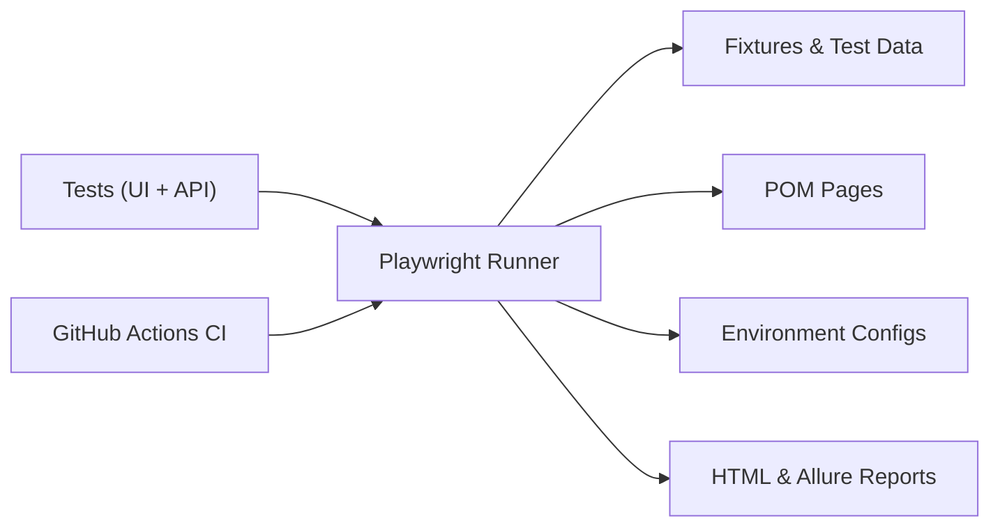

# Saucedemo Playwright Automation Framework


A clean, scalable **Playwright + TypeScript** automation framework using the Page Object Model (POM), fixtures, reusable utilities, API tests, and GitHub Actions CI. Built to mirror an enterprise-grade framework structure.

**System under test:** [saucedemo.com](https://www.saucedemo.com)

---

## Tech Stack

- Playwright (TypeScript)
- Page Object Model (POM)
- Fixtures & centralised test data
- Environment configs (dev / stage / prod)
- API testing (Playwright request context)
- GitHub Actions CI
- HTML & Allure reporting

---

## Folder Structure

```
├── config/                  # dev.json, stage.json, prod.json
├── fixtures/                # login fixture + test data
├── pages/                   # Page Object Model classes
├── tests/                   # UI + API tests
├── utils/                   # Helpers
├── playwright.config.ts     # Global config
├── playwright.config.*.ts   # Environment-specific configs
└── .github/workflows/       # CI pipeline
```

---

## Architecture



---

## Test Coverage

### UI Tests
- **Login** — valid, invalid and locked-out user scenarios
- **Inventory** — sorting, add/remove items
- **Cart** — badge count, add/remove
- **Checkout** — customer info, order summary, completion
- **Smoke suite** — critical-path checks

### API Tests
- Fetch users
- Create user

---

## Fixtures & Test Data

Centralised test data (`fixtures/testdata.ts`):

```ts
export const users = {
  standard: { username: 'standard_user', password: 'secret_sauce' },
  locked:   { username: 'locked_out_user', password: 'secret_sauce' }
};
```

Reusable login fixture (`fixtures/baseTest.ts`) lets any test start authenticated:

```ts
await loginAs('standard');
```

---

## Getting Started

Install dependencies and browsers:

```bash
npm install
npx playwright install
```

Run all tests:

```bash
npx playwright test
```

Run in headed mode:

```bash
npx playwright test --headed
```

Run against a specific environment:

```bash
npm run test:dev
npm run test:stage
npm run test:prod
```

View the HTML report:

```bash
npx playwright show-report
```

---

## CI/CD

Every push triggers the GitHub Actions pipeline (`.github/workflows/playwright-ci.yml`), which:

1. Installs dependencies and Playwright browsers
2. Runs the full UI + API test suite
3. Uploads the HTML report as a build artifact

---

## Author

**Richa Gupta** — Senior QA Automation Engineer / SDET
Playwright | TypeScript | CI/CD | Automation Frameworks

[LinkedIn](https://www.linkedin.com/in/richa-gupta-qa) · [GitHub](https://github.com/richagupta09)
